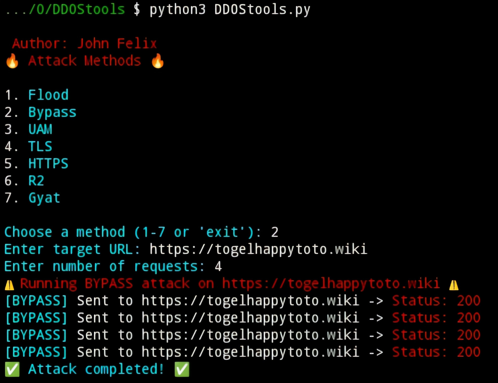

## WHAT IS DDoS
- DDoS (Distributed Denial of Service) is a cyber attack that makes a service or server inaccessible by flooding it with large amounts of internet traffic from multiple sources (usually botnets). As a result, the system

## FEATURE
- Flood – Attack by flooding the target with excessive requests (DDoS).
- Bypass – Techniques to bypass security protection.
- UAM – Targeting Cloudflare protection mode "Under Attack Mode".
- TLS – Attacking the TLS protocol with encrypted requests.
- HTTPS – Server flooding attack HTTPS.
- R2 – Specific methods, possibly related to bypass or HTTP attacks.
- Gyat – Uncommon term, perhaps a specific method in a particular tool.

## INSTALLATION WITH TERMUX
```
$ pkg update && pkg upgrade
$ pkg install python3
$ pkg install git
$ git clone https://github.com/JohnFelixx/DDOStools
$ cd DDOStools
$ pip install requests
$ python3 DDOStools.py
```
## INSTALLATION WITH LINUX
```
$ apt update && apt upgrade
$ apt install python3
$ apt install git
$ git clone https://github.com/JohnFelixx/DDOStools
$ cd DDOStools
$ pip install requests
$ python3 DDOStools.py
```

## Screenshot


## CONTACT US
- [YouTube](https://youtube.com/sonymodderr)
- [Instagram](https://instagram.com/kuciinglangka)
- [Telegram](https://t.me/OrdinaryPeople403)

## SUPPORT ME
- [Saweria](https://saweria.co/SonySec07)
